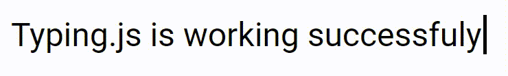
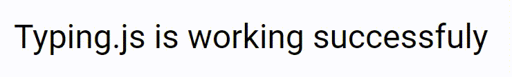

# typing.js
Need a typing for your history, for roman, for others in your code? Now **typing.js** is here.

## What is typing.js
**typing.js** is a framework that allows to type automatically if you have put a value in the tag.

## Installation
You can use typing.js via CDN
- CDN:
  - Normal: https://jsdelivr.net/gh/Dob6458/typingjs/libs/typing.js
  - Minified: https://jsdelivr.net/gh/Dob6458/typingjs/libs/typing.min.js

## Changelogs
You can check it in [CHANGELOG.md](CHANGELOG.md) file in this repository

## Code
Once **typing.js** installed, import it using `<script>` tag on HTML file:
### Importation
```html
<!--
  Use this code in <head> or <body> tag
-->
<script src="typing.js"></script>
<script src="index.js"></script>

<!--
  Use <span> or <div> tags
-->
<span id="typing">Typing.js is working successfuly</span>
```

Then, create a file called `index.js` file and copy this code.
### Simple code
```js
window.onload = function() {
  /**
    You can use the id, class or tags through "document.querySelector()"
  */
  var typing = new Typing("#typing");
  typing.start();
}
```
Automatically, this selected element is gonna type!

#### Result:



### Typing with options
Of course, you can use options to edit something:
```js
window.onload = function() {
  // There's options in this code
  var typing = new Typing("#typing", {
    color: "orange",
    speed: 40,
    transition: 150
  });
  typing.start();
}
```
#### Result:



We have created this options through `Object.assign({}, options_default, options)`
### Events
```js
window.onload = function() {
  var typing = new Typing("#typing");

  typing.on("click", function() {
    // Code here
  });
}
```
We use `document.addEventListener(event, callback)` for the events if `Typing()` class is declared.

## Issues or Feedback
If you have a problem, please, create an [issue](https://github.com/Dob6458/typingjs/issues) on Github or contact me on:
- Discord: // ζohιπ#5914
- Sololearn Profile ID: 6015460
